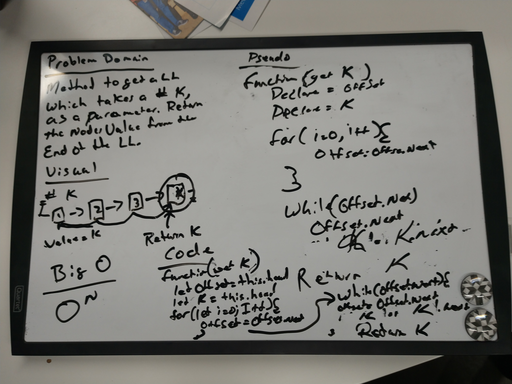

# Insert and shift middle index of array
<!-- Short summary or background information -->
Insr and shift an array in middle at index
## Challenge
<!-- Description of the challenge -->
Write a function called insertShiftArray which takes in an array and the value to be added. Without utilizing any of the built-in methods available to your language, return an array with the new value added at the middle index.
## Solution
<!-- Embedded whiteboard image --># data-structures-and-algorithms
 

#
#

# Binary Search
<!-- Short summary or background information -->
Binary search in a sorted 1D array

## Challenge
<!-- Description of the challenge -->
Write a function called BinarySearch which takes in 2 parameters: a sorted array and the search key. Without utilizing any of the built-in methods available to your language, return the index of the array’s element that is equal to the search key, or -1 if the element does not exist.

## Solution
<!-- Embedded whiteboard image -->
 

#
#

# ​ k-th value from the end of a linked list. ​
<!-- Short summary or background information -->
get the ​ k-th value from the end of a linked list. ​

## Challenge
<!-- Description of the challenge -->
Write a method for the Linked List class which takes a number, k, as a parameter. Return the node’s value that is k from the end of the linked list. You have access to the Node class and all the properties on the Linked List class as well as the methods created in previous challenges. ​

## Solution
<!-- Embedded whiteboard image -->
 

#
#

# Merge two Linked Lists
<!-- Short summary or background information -->
take two linked list and merge them

## Challenge
<!-- Description of the challenge -->
Write a function called mergeLists which takes two linked lists as arguments. Zip the two linked lists together into one so that the nodes alternate between the two lists and return a reference to the head of the zipped list. Try and keep additional space down to O(1). You have access to the Node class and all the properties on the Linked List class as well as the methods created in previous challenges.

## Solution
<!-- Embedded whiteboard image -->
 
