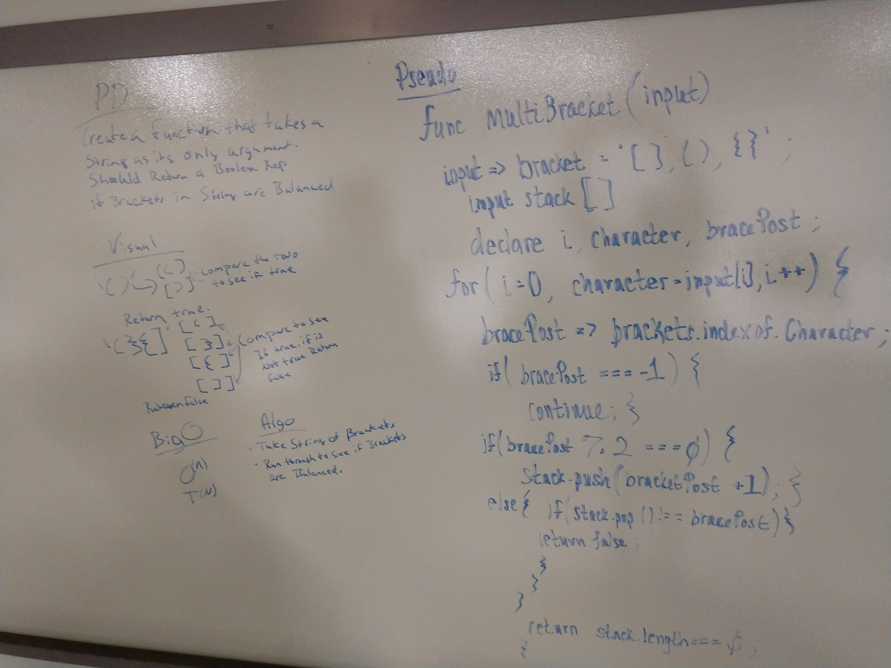

# Insert and shift middle index of array
<!-- Short summary or background information -->
Insr and shift an array in middle at index
## Challenge
<!-- Description of the challenge -->
Write a function called insertShiftArray which takes in an array and the value to be added. Without utilizing any of the built-in methods available to your language, return an array with the new value added at the middle index.
## Solution
<!-- Embedded whiteboard image --># data-structures-and-algorithms
 

#
#

# Binary Search
<!-- Short summary or background information -->
Binary search in a sorted 1D array

## Challenge
<!-- Description of the challenge -->
Write a function called BinarySearch which takes in 2 parameters: a sorted array and the search key. Without utilizing any of the built-in methods available to your language, return the index of the array’s element that is equal to the search key, or -1 if the element does not exist.

## Solution
<!-- Embedded whiteboard image -->
 

#
#

# Stacks and Queues
<!-- Short summary or background information -->
Lab 10: Stacks and Queues
Implement a Stack and a Queue Data Structure

## Challenge
<!-- Description of the challenge -->
Create a Node class that has properties for the value stored in the Node, and a pointer to the next node
Create a Stack class that has a top property. It creates an empty Stack when instantiated.
This object should be aware of a default empty value assigned to top when the stack is created.
Define a method called push which takes any value as an argument and adds a new node with that value to the top of the stack with an O(1) Time performance.
Define a method called pop that does not take any argument, removes the node from the top of the stack, and returns the node.
Define a method called peek that does not take an argument and returns the node located on the top of the stack.
Create a Queue class that has a top property. It creates an empty queue when instantiated.
This object should be aware of a default empty value assigned to front when the queue is created.
Define a method called enqueue which takes any value as an argument and adds a new node with that value to the back of the queue with an O(1) Time performance.
Define a method called dequeue that does not take any argument, removes the node from the front of the queue, and returns the node.
Define a method called peek that does not take an argument and returns the node located in the front of the stack.
At no time should an exception or stack trace be shown to the end user. Catch and handle any such exceptions and return a printed value or operation which cleanly represents the state and either stops execution cleanly, or provides the user with clear direction and output.
Be sure to follow your languages best practices for naming conventions.

## API
<!-- Description of each method publicly available to your Stack and Queue-->
Stack:

  push() - adds an element to the stack

  pop() - removes an element from the stack, if the function is call on an empty stack it indicates "Empty"

  peek() - returns the top most elements in the stack, but does not delete it.

  isEmpty() - return true if the stack is empty

  printStack() - returns a sting in which all the element of a stack is concatenated
 

Queue:

  enqueue() - adds an element to the queue

  dequeue() - removes an element from the front of the queue

  front() -  returns the front element of the queue

  isEmpty() - Returns true if th queue is empty
  
  printQueue() - returns all elements of the queue

# Merge two Linked Lists
<!-- Short summary or background information -->
take two linked list and merge them

## Challenge
<!-- Description of the challenge -->
Write a function called mergeLists which takes two linked lists as arguments. Zip the two linked lists together into one so that the nodes alternate between the two lists and return a reference to the head of the zipped list. Try and keep additional space down to O(1). You have access to the Node class and all the properties on the Linked List class as well as the methods created in previous challenges.

## Solution
<!-- Embedded whiteboard image -->
 

#
#

# Implement a Queue using two Stacks.
<!-- Short summary or background information -->

## Challenge
<!-- Description of the challenge -->

## Approach & Efficiency
<!-- What approach did you take? Why? What is the Big O space/time for this approach? -->

## Solution
<!-- Embedded whiteboard image -->

#
#

# First-in, First out Animal Shelter.
<!-- Short summary or background information -->
First-in, First out Animal Shelter.

## Challenge
<!-- Description of the challenge -->
Create a class called AnimalShelter which holds only dogs and cats. The shelter operates using a first-in, first-out approach.
Implement the following methods:
enqueue(animal): adds animal to the shelter. animal can be either a dog or a cat object.
dequeue(pref): returns either a dog or a cat. If pref, a string, is ‘cat’ return the longest-waiting cat. If pref is ‘dog’, return the longest-waiting dog. For anything else, return either a cat or a dog.

## Solution
 

#
#

# Multi-bracket Validation.
<!-- Short summary or background information -->
Your function should take a string as its only argument, and should return a boolean representing whether or not the brackets in the string are balanced.

## Challenge
<!-- Description of the challenge -->
Your function should take a string as its only argument, and should return a boolean representing whether or not the brackets in the string are balanced. There are 3 types of brackets:

Round Brackets : ()
Square Brackets : []
Curly Brackets : {}

## Approach & Efficiency
<!-- What approach did you take? Why? What is the Big O space/time for this approach? -->
Big O = O(n)
for this approach I am taking the testing brackets and running them through a stack and checking them through the stack in each position to check to see if has been used in the array and what position and comparing the two.

## Solution
<!-- Embedded whiteboard image -->

# First Repeated Word
<!-- Short summary or background information -->
first repeated word

## Challenge
<!-- Description of the challenge -->
return the first repeated word
#
#

# FizzBuzz on a tree
<!-- Short summary or background information -->
Conduct “FizzBuzz” on a tree while traversing through it. Change the values of each of the nodes dependent on the current node’s value

## Challenge
<!-- Description of the challenge -->
Write a function called FizzBuzzTree which takes a tree as an argument.
Without utilizing any of the built-in methods available to your language, determine weather or not the value of each node is divisible by 3, 5 or both, and change the value of each of the nodes:

- If the value is divisible by 3, replace the value with “Fizz”
- If the value is divisible by 5, replace the value with “Buzz”
- If the value is divisible by 3 and 5, replace the value with “FizzBuzz”

Return the tree with its news values.

## Approach & Efficiency
<!-- What approach did you take? Why? What is the Big O space/time for this approach? -->
Big O = O(n)

for this approach i goting to put each word in a seperate array then i am going to compare that the current word by using two for loops like the tortise and the hare and when they both match the first time it will return said word.

## Solution
<!-- Embedded whiteboard image -->

#
#

# Tree Intersection
<!-- Short summary or background information -->
Find common values in 2 binary trees.

## Challenge
<!-- Description of the challenge -->
Write a function called tree_intersection that takes two binary tree parameters.

for this im going to test that the numbers are actually in the tree. Test to see if they are actually numbers instead of objects. 

## Solution
<!-- Embedded whiteboard image -->

# Breadth-first Traversal.
<!-- Short summary or background information -->
return all values in the tree

## Challenge
Write a breadth first traversal method which takes a Binary Tree as its unique input. Without utilizing any of the built-in methods available to your language, traverse the input tree using a Breadth-first approach; print every visited node’s value.

## Approach & Efficiency
<!-- What approach did you take? Why? What is the Big O space/time for this approach? -->
Big O = O(n)
i would test to see if the numbers returned are actually in the tree, check to see if they are not objects

## Solution
<!-- Embedded whiteboard image -->

# Find the Maximum Value in a Binary Tree
<!-- Short summary or background information -->
return max value in the tree

## Challenge
find the max value in the binary tree.

i would test to see if the numbers returned are actually in the tree, check to see if they are not objects

## Solution
<!-- Embedded whiteboard image -->

## Approach & Efficiency
<!-- What approach did you take? Why? What is the Big O space/time for this approach? -->
Big O = O(n)

compare between both trees to findany cmmon nodes. 

## Solution
<!-- Embedded whiteboard image -->

#
#

# Implement a simplified LEFT JOIN for 2 Hashmaps.
Write a function that LEFT JOINs two hashmaps into a single data structure

## Challenge
The first parameter is a hashmap that has word strings as keys, and a synonym of the key as values.
The second parameter is a hashmap that has word strings as keys, and antonyms of the key as values.
Combine the key and corresponding values (if they exist) into a new data structure according to LEFT JOIN logic.
LEFT JOIN means all the values in the first hashmap are returned, and if values exist in the “right” hashmap, they are appended to the result row. If no values exist in the right hashmap, then some flavor of NULL should be appended to the result row.

## Approach & Efficiency
Big O = O(n)
took two maps and joined them were they were common

## Solution

